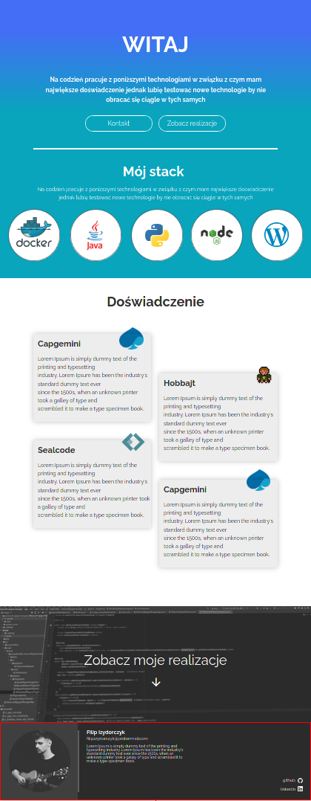
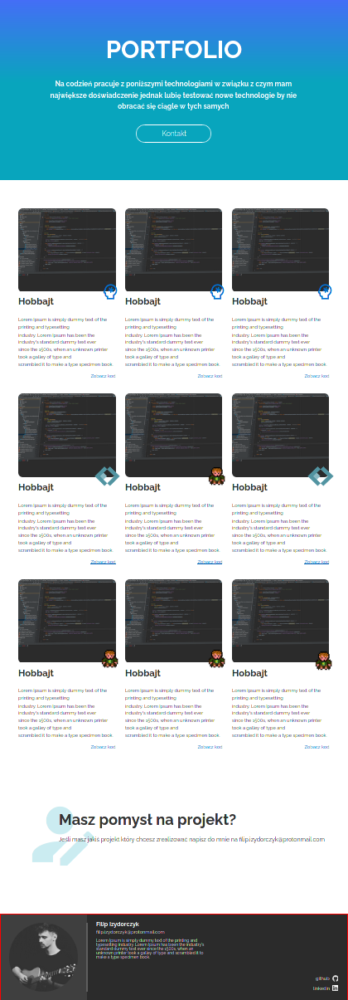

This repo is archived since I no longer need this website and I probably wont finish it.

This is repo with my website that is currently in development stage. It is going to look like this:




# Build

-   `npm install` - install dependencies
-   `npm run build` - builds static html files
-   `npm run serve` - starts local server with last website build

# Code conduct

## Typescript

1. Each segment should be covered with `section` tag with `id`

```html
<section id="id"></section>
```

2. In code use camel case

3. Join maped element with new lines

```js
`<div class="stepped-list__container">
    ${elements.map((element) => `<div></div>`).join("\n")}
</div>`;
```

4. Content passed to component should be seperated of the component for readability

```js
const SliderData: StackSliderArgs = {
    title: loremIpsum.generateWords(3),
    description: loremIpsum.generateSentences(4),
    items: stack,
};

//...

SteppedList(steppedListData);
```

If component lets you to pass other component as arg do this that way

```js
const tobBarData: TopBarArgs = {
    title: "Test",
    description: loremIpsum.generateSentences(3),
    buttons: [
        { text: "Button", href: "#" },
        { text: "Button", href: "#" },
    ],
};

//...

TopBar({ ...tobBarData, extraComponent: StackSlider(SliderData) });
```

## Styles

1. Use BEM naming convention for calss attribute
2. In scss files keep given order: rules, css classes, html tags, media selectors

```scss
&__example {
    color: $white;

    &--black {
        color: $black;
    }

    & img {
        width: 100%;
    }

    @media (max-width: $text-breakpoint) {
        font-size: $font-size-200;
    }
}
```

# Resources

Slider that is used in this project is [siema slider](https://github.com/pawelgrzybek/siema).
Logos were searched on [seek logo](https://seeklogo.com/), [wikimedia](https://commons.wikimedia.org), [remixicons](https://remixicon.com/) or on companies websites.
